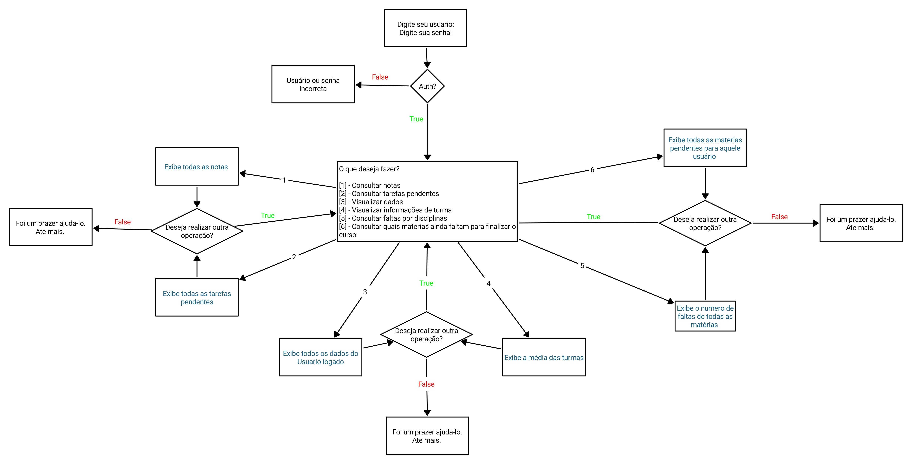

# Descrição 
Este diretório contém a implementação de um chatbot que visa auxiliar os alunos a navegarem pelo <a href="https://sig.cefetmg.br/admin/public/loginunificado/index.jsf">Sigaa</a>. Seu desenvolvimento foi realizado de forma estática, o qual, definimos uma <a href="https://github.com/Sr-Souza-dev/AI/blob/main/prolog/chatbot/kb.pl">Base de Dados (KB)</a> que simula as possíveis informações retornadas pelo back-end da plataforma. O código do chatbot pode ser visualizado <a href="https://github.com/Sr-Souza-dev/AI/blob/main/prolog/chatbot/main.pl">clicando aqui</a>

## Fluxograma do chatbot
O fluxograma do chatbot pode ser visualizado abaixo, sendo que as escritas em azul são respostas do sistema após consultar a base de dados.

## Integrantes
Gabriel de Souza Rosa  
Yuri Dimitre Dias de Faria