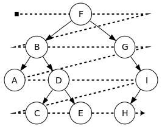
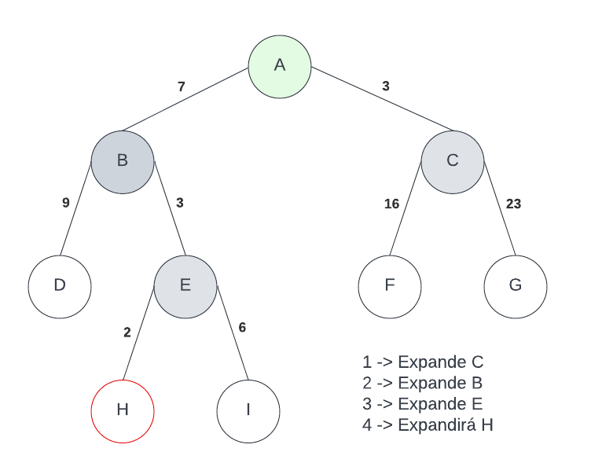
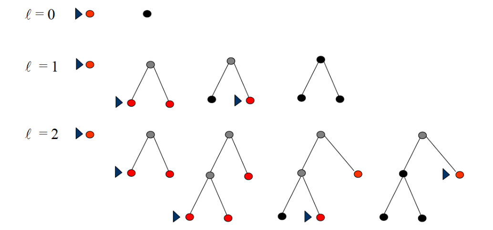
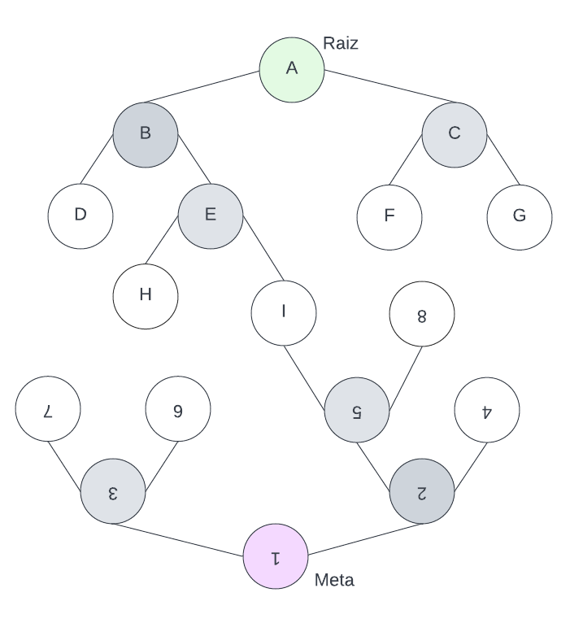
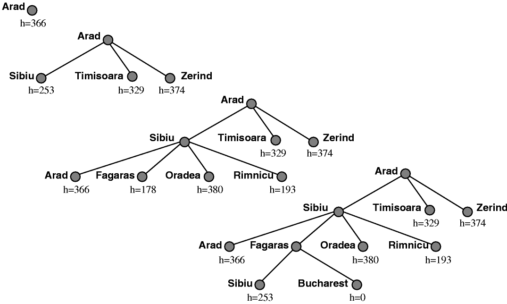

## Árvores de Busca
Há dois tipos de busca em arvores:
1. Não informado: Usuam somente definições do problema (como: depth-first, breadth-first...)
2. Informado: Usam conhecimento sobre o domínio (além) do problema e heurísticas (como: Greedy best-first, A*).

### Medição de desempenho de resolução de problemas e coplexidade
#### Desempenho:
1. Completeza: O algoritmo é capaz de achar a solução se ela existir.
2. Otimização: O algoritmo é capaz de encontrar uma resolução ótima. 
3. Complexidade de Tempo: É o tempo que o algoritmo gasta para encontrar determimnada solução.
4. Complexidade de espaço: É o espaço em memória que o algoritmo gata para enocntrar determinada solução.

#### Complexidade:
1. Fator de Ramificação (b): número máximo de sucessores de um nó;
2. Profundidade (d): profundidade do nodo objetivo mais raso;
3. Comprimento Trajetória (m): maior entre todas as trajetórias. 

## Buscas não Informadas

### Breadth-First Search (Busca em largura)
A busca em largura expande sempre toda a fronteira até encontrar o resultado (meta), ou seja, ela verifica o primeiro filho do node, caso ele não seja o resultado ela o expande, em seguida ela verifica o segundo filho do node, caso ele não seja o resultado ela o expande também, fazendo isso até encontrar a meta. Gerando uma árvore com mais nós folhas devido a sua maneira de expansão e ao armazenamento dos nodos.

* *Completeza*: completo (se b é finito);
* *Otimização*: não necessariamente ótimo, a menos que o custo trajetória seja igual para todas as direções de expansão;
* *Complexidade de Tempo e espaço*: tempo e memória (profundidade da meta = d, qtd de filhos em cada nodo = b) -> b + b^2 + ... + b^d = O(b^d).  

### Uniform Cost Search (Busca de custo uniforme)
No algoritmo de busca de custo uniforme as transições de um nodo para outro são ponderadas, sendo que, atráves desse valor o algoritmo faz sua escolha de expansão, ou seja, ele expandirá sempre a fronteira que tiver menor custo em relação a raiz da árvore.

* *Completeza*: Completo se cada passo tem custo ε > 0;
* *Otimização*: Ótimo geral
* *Complexidade de Tempo e espaço*: O(b^{1 + (C*/ε)}) >= O(b^d);
* *Complexidade de Tempo e espaço (se custo dos passos iguais)*: O(b^{d+1});
em que 'C*' é o custo da solução ótima, 'd' profundidade da meta e 'b' qtd máx de filhos em cada nodo.

### Depth-First Search (Busca em profundidade)
Expande/percorre de um vertice até os vértices 'filhos', o mais profundo possível, para somente depois retroceder. (Seu objetivo é descer/aprofundar ao máximo respeitando uma lógica inicial até encontrar o resultado esperado). Caso o algoritmo chegue no ponto mais profundo daquele caminho e não encontre a meta, ele começará a retroceder e apagar as partes já visitadas da arvore para poupar espaço de armazenamento. 

* *Completeza*: Este código pode ser considerado completo dependendo do ambiente ao qual ele está operando, caso o ambiente tenha muitos/infinitos estados ele demorará muito para encontrar uma resposta, ou nem encontrará (Completo somente para espaço de estado finito).
* *Otimização*: Não, pois ele aceitará a primeira solução encontrada.
* *Complexidade de Tempo*: O(b^s), tal que 'b' é a quantidade de nodos filhos que um nodo tem e 's' é a profundidade máxima de um nodo.
* *Complexidade de espaço*: O(bs)  

### Depth-limited Search (Busca em profundidade Limitada)
A busca em profundidade limitada é uma modificação da busca em profundidade explicada no tópico antérior. Para tentar amenizar a ideia de que possa haver um caminho infinito em ralação a profundidade, esse tipo de busca delimita o tamanho em que o algoritmo pode explorar da árvore, focando apenas em uma arvore menos de altura (l) definida pelo programador. 

* *Completeza*: Não é completo, pois o tamanho 'l' escolhido pode ser menor que o tamanho 'd' (produndidade do nodo meta).
* *Otimização*: Não é otimo. 
* *Complexidade de Tempo e espaço*: O(b^l)
obs: Conhecimento do dominio da aplicação ajuda a delimitar o limite.

### Iterative-deepening Search (Busca em profundidade progressiva)
Sendo um algoritmo considerado evolução do algoritmo anterior (Depth-limited Search), neste tipo de busca, o limite é algo dinâmico, sendo atualizado a cada tentativa sem sucesso. Ou seja, ele realizará a primeira interação com um limite 'X', caso ele não encontre a meta, ele fará outra interação com limite 'X+ε', segue assim recurssivamente até encontrar a meta, caso ela exista.

* *Completeza*: Sim se caso o espaço de estados seja finito
* *Otimização*: SIm se os custos de transição forem iguais em toda arvore
* *Complexidade de Tempo*: O(b^d)
* *Complexidade de espaço*: O(bd)
em que, 'b' é o fator de ramificação e 'd' é a profundidade da solução. 

### Bidirectional Search (Busca bidirecional)
Nem tanto um algoritmo, mas parte mais de uma ideia de como buscar determinado caminho tendo conhecimento da sua meta. No algoritmo de busca bidirecional são feitas buscas em largura ou profundidade na raiz e meta da arvore, quando as duas busca encontram um nodo em comum, significa que um caminho que conecta a meta a raiz foi encontrado. 

* *Completeza*: Sim se 'b' finito
* *Otimização*: sim se custos de transição entre os nodos forem iguais.
* *Complexidade de Tempo e espaço*: O(b^{d/2})

## Buscas Informadas
A técnica de busca informada utiliza o conhecimento específico do problema para dar uma pista para a solução do problema. Aqui, a parte mais importante da técnica informada é a função heurística (h(n)) que facilita a transmissão do conhecimento adicional do problema ao algoritmo. Como resultado, ajuda a encontrar o caminho para o objetivo através dos vários nós vizinhos. Existem vários algoritmos baseados na pesquisa informada, como pesquisa heurística em profundidade, pesquisa heurística em amplitude/largura, busca A *, etc.
 
A pesquisa informada pode ser vantajosa em termos do custo, em que a otimização é alcançada com custos de pesquisa mais baixos.

### Caracteristicas
* Conhecimento domínio + problema;
* Função avaliação f(n);
* Função heurística h(n);
* Conhecimento na forma de heurísticas;
* Algoritmos do tipo best-first (melhor escolha).

em que:
* n: nó da árvore;
* f(n): valor de f em n (estimativa custo mínimo através de n);
* g(n): custo do caminho da raiz até n;
* h(n) : estimativa do custo mínimo de n até a meta

### Best First / Greedy Search (Busca Gulosa)
Os algoritmos de busca gulosa é similar do algoritmo de busca de custo uniforme, sendo a heurística a função que pondera o custo de cada nodo/transição. Diferente do algoritmo de busca de custo uniforme que visa o ótimo geral, esse algoritmo visa encontrar a solução o mais rápido possível (com menor custo computacional) atráves da heurística inserida, sem garantir otimalidade. Ou seja, enquanto no algoritmo de custo uniforme o nodo expandido é o de menor custo em relação ao nodo atual, na busca gulosa o nodo expandido é o que está mais próximo a meta (condição final) de acordo com a heurística inserida.

* *Completeza*: Na maioria dos casos ele é incompleto (depende da heurística aplicada) 
* *Otimização*: Não é ótimo, devido a sua busca ser direcionada ao menor gasto computacional possível, ele somente tenta encontrar a solução.
* *Complexidade de Tempo e espaço*: O(b^m), em que 'b' é o fator de ramificação da arvore e 'm' é a profundidade máxima da arvore de busca.

 
OBS: O algoritmo de busca gulosa considera somente a heurística do problema, sendo: f(n) = h(n)

### Best First / A*
Para esse algoritmo garantir a otimalizadade do problema, é necessario que haja uma heurística admissível, sendo que, uma heurística é dita como admissível se ela nunca superestima o custo h(n) de atingir o objetivo a partir do nodo n (g(n) + h(n) <= g(n*) === O custo do caminho da raiz até o nodo + o custo da heuristica do nodo até a meta deve ser <= Ao custo real da raiz até a meta)
Essa busca utiliza de duas informações para definir os seus passos, ela soma o custo da raiz até um determinado nodo e desse mesmo nodo até a meta (por heuristica), o nodo que apresentar o menor valor é o que será expandido e sequentemente verificado.

* *Completeza*: Sim
* *Otimização*: Sim (se heuristica admissivel)
* *Complexidade de Tempo e espaço*: Complexidade é exponencial
* *Complexidade de espaço*: