## Artificial Neural Networks
A hipótese de que a atividade mental consiste basicamente na atividade eletroquímica em redes de células cerebrais chamadas neurônios inspirou varia teorias. Alguns dos trabalhos mais antigos de IA tiveram o objetivo de criar redes neurais artificiais (outros nomes do campo incluem conexionismo, processamento distribuído em paralelo e computação neural). Grosseiramente
falando, ele “dispara” quando uma combinação linear de suas entradas excede algum limiar (rígido
ou suave), ou seja, ele implementa um classificador linear. Uma rede neural é apenas uma coleção de unidades conectadas; as propriedades da rede são determinadas pela sua topologia e pelas propriedades dos “neurônios”.

<a href="https://medium.com/@avinicius.adorno/redes-neurais-artificiais-418a34ea1a39">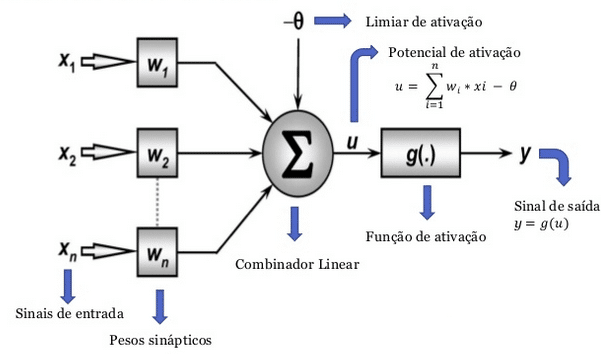</a>

### Activation Functions
Muitas funções de ativação diferentes têm sido testadas ao longo dos anos, mas apenas algumas encontraram aplicações práticas relevantes. Entre estas, pode-se citar:

| Descrição | Saída | Gráfico |
| --------- | ----- | ------- |
| As funções de limiar estrito, como o degrau e o sinal(.) | y = 1, se net ≥ 0 y = 0, se net < 0   y = 1, se net ≥ 0 ou y = −1, se net < 0 | 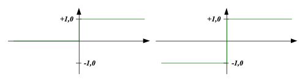 |
| As funções lineares com e sem saturação da saída. | y = 1, se net > 0; y = net, se − 1 < net < 1; ou y = −1, se net < −1   y = λ.net | 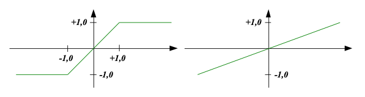 |
| As funções sigmoidais unipolares e bipolares | 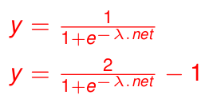 | 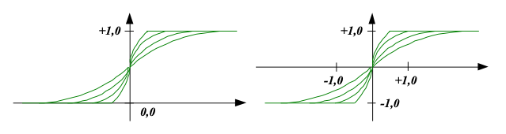 |

Existem duas formas fundamentalmente distintas para conectar esse neurônios e formar uma rede, sendo elas:  
**Rede com alimentação para frente:** Tem conexão somente em uma direção, isto é, forma um grafo acíclico dirigido. Uma rede com alimentação para frente representa uma função de sua entrada atual, portanto, não tem estado interno que não seja os próprios pesos.  

**Rede recorrente:** Alimenta suas saídas de volta às suas próprias entradas. Isso significa que os níveis de de ativação da rede formam um sistema dinâmico que pode atingir um estado estável ou apresentar oscilações ou até mesmo um comportamento caótico. Além disso, a resposta da rede para determinada entrada depende do seu estado inicial, que pode depender de entradas anteriores. Portanto, as redes recorrentes (ao contrário das redes com alimentação para a frente) podem suportar memória de curto
prazo. Isso as torna mais interessantes como modelos de cérebro, mas também mais difícil de entender.

### Single-layer forward-feeding neural networks (Perceptrons)
Uma rede com todas as entradas conectadas diretamente com as saídas é chamada de rede neural de camada única ou rede perceptron. Os perceptrons são capazes de solucionar apenas problemas linearmente separáveis (representam uma pequena fração de todas as funções booleanas). É importante notar que uma rede perceptron com 'm' saídas é realmente 'm' redes separadas, pois cada peso afeta apenas uma das saídas.

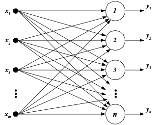

### Multilayer forward-feeding neural networks (MLP - Milti-Layer Perceptron)
Como os perceptrons são capazes de somente representar conjuntos lineramente separáveis (funções lineares), foi-se desenvolvido a rede multicamada que trabalha com mais de um perceptron (adicionando o conceito de camadas ocultas) com alimentação para frente, gerando a capacidade para realizar regressão não linear.

Com mais unidades ocultas, podemos produzir outros sobressaltos de tamanhos diferentes em outros lugares. Na verdade, com uma camada oculta única, suficientemente grande, é possível representar qualquer função contínua de entrada com precisão arbitrária; com duas camadas, podem ser representadas até mesmo funções descontínuas. Infelizmente, para qualquer estrutura de rede
particular, é mais difícil caracterizar exatamente as funções que podem ser representadas e as que não podem.

<a href="https://www.zigsley.top/products.aspx?cname=feedforward+deep+neural+network&cid=7">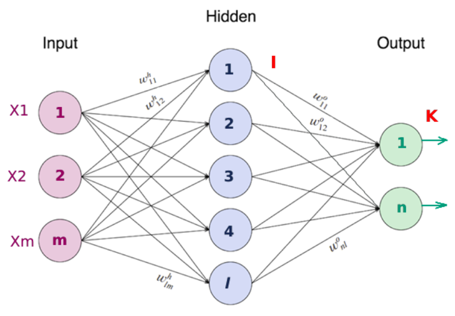</a>

#### Learning in multilayer networks
O metódo de treinamento de uma rede perceptron é conhecido, tal que podemos calcular o erro fazendo uma comparação da saída desejada com a saída encontrada e ajustar os pesos a partir disso, porém, em uma rede multicamada não é tão simples assim, enquanto que o erro 'y − h_w' na camada de saída é claro, o erro nas camadas ocultas parece misterioso porque os dados de
treinamento não dizem que valor os nós ocultos devem ter. Felizmente, verifica-se que podemos retropropagar o erro da camada de saída para as camadas ocultas. O processo de retropropagação emerge diretamente de uma derivação do gradiente de erro geral.

| Regra | Descrição | Formúla |
| ----- | --------- | ------- |
| Calculo do erro da ultima camada | Y_{DK}(p) = saída desejada para o neurônio k na interação p | 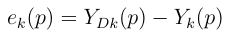 |
| Calculo do peso da última camda (output) | É similar à da regra Delta, aplicada ao perceptron | 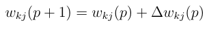 |
| Erro Modificado | onde, δ_k(p) é o gradiente do erro cometido | 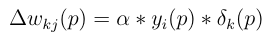 |
| Gradiente do erro cometido | Derivada da função de ativação multiplicada pelo erro de sua saída | 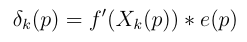 |
| Calculo do peso das camadas ocultas | onde, δ_k(p) é o gradiente do erro cometido no neurônio j da camada oculta na inteção p | 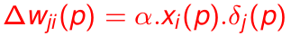 |
| Gradiente do erro no neurônio J | em que y_j é a saída do neurônio j | 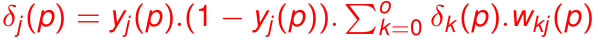 |
| Regra Delta | Calculo em geral Perceptron | 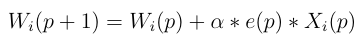 |

onde w_j(p) corresponde ao peso da entrada j, α é a taxa de aprendizado, e(p) é uma medida de erro e x_j(p) a entrada j do neurônio.

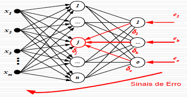

O processo de retropropagação pode ser resumido da seguinte forma:

| BackPropagation | Aplicada a função sigmoidal |
| --------------  | --------------------------- |
| 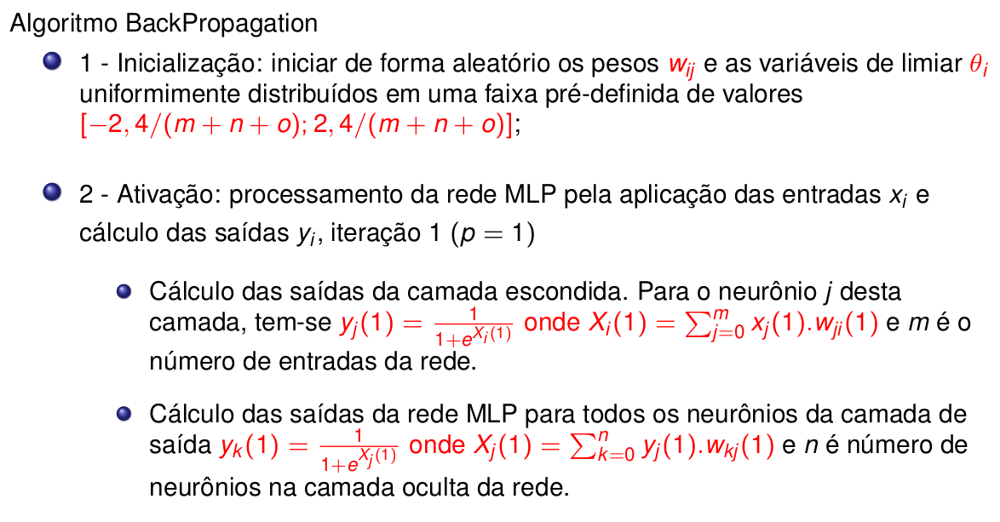 | 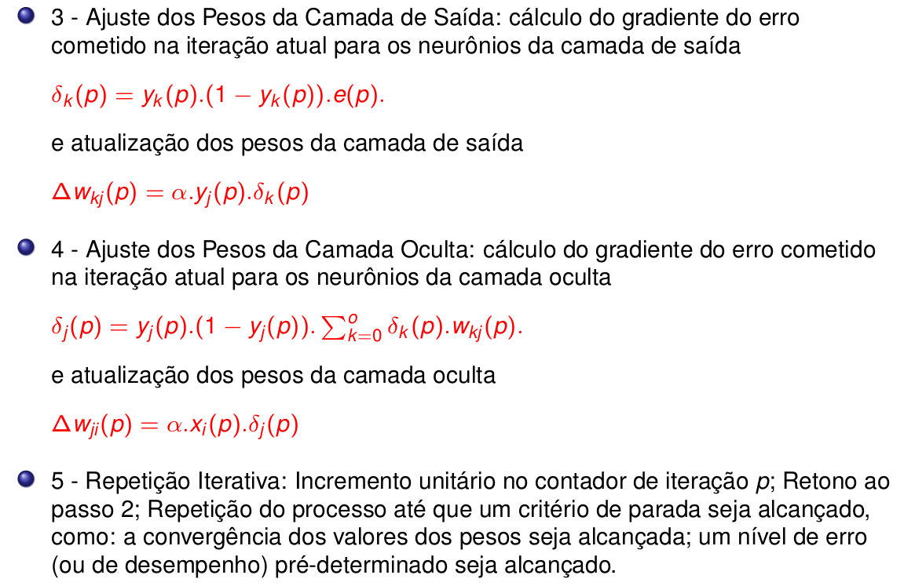

# References 
<a href="https://medium.com/@avinicius.adorno/redes-neurais-artificiais-418a34ea1a39">Artificial Neural Networks</a>  