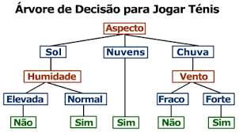
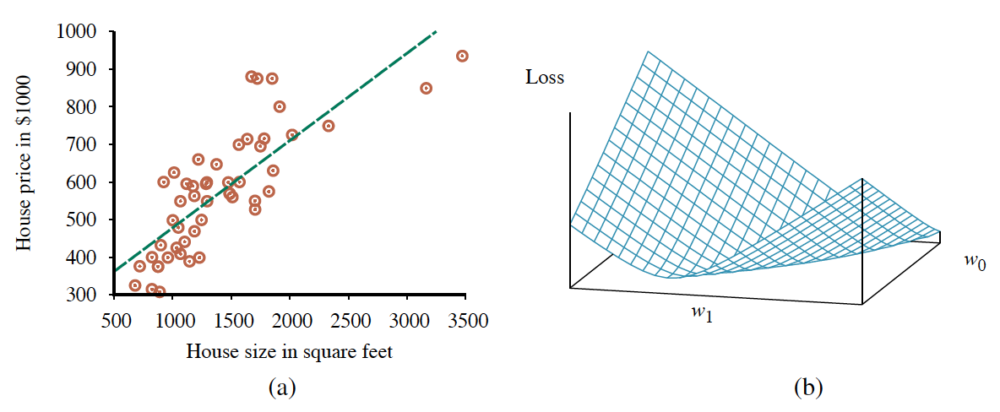
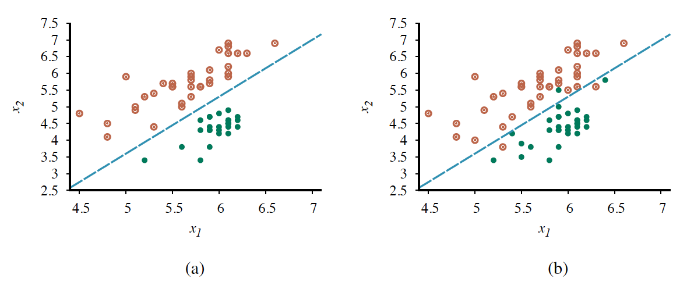
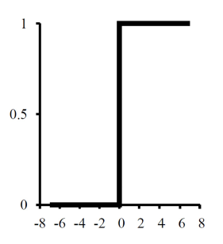
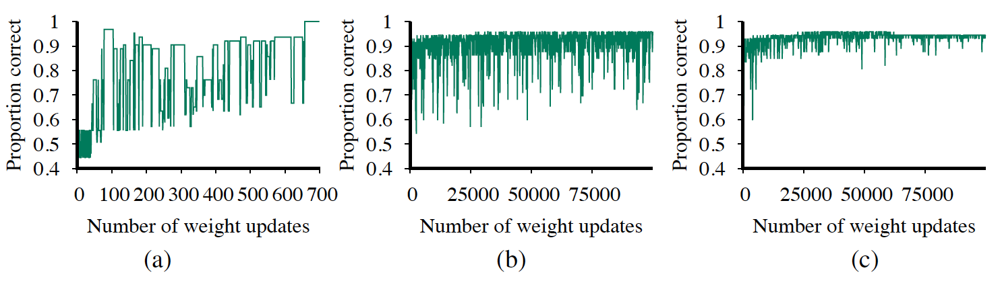
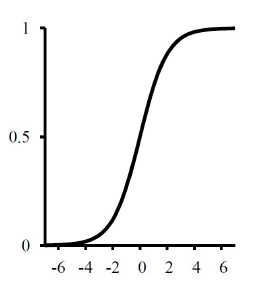
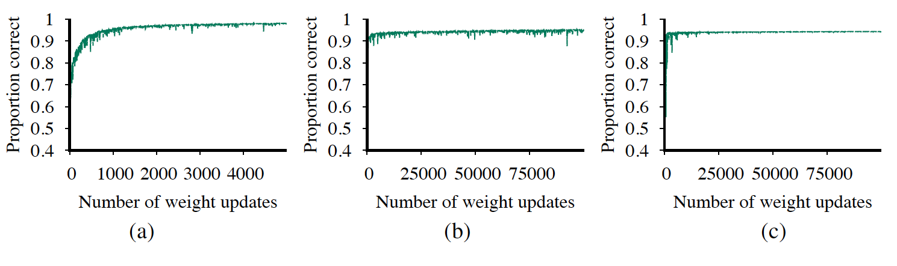
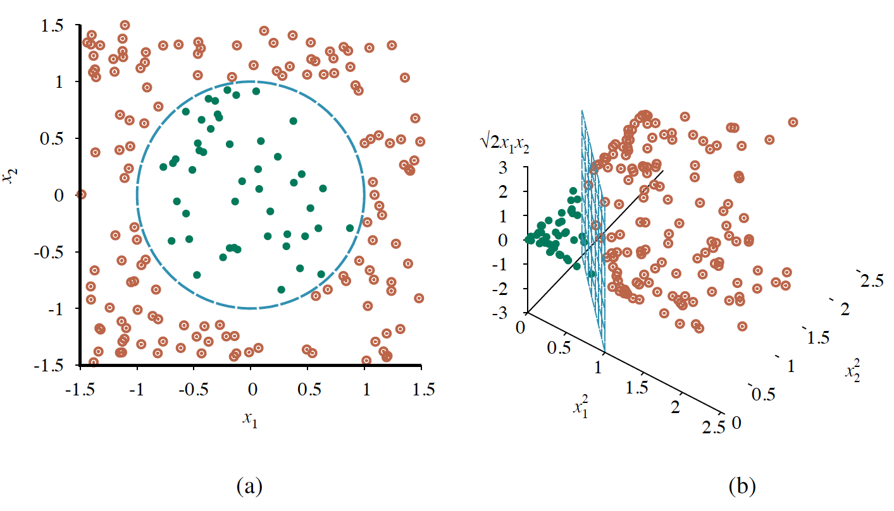
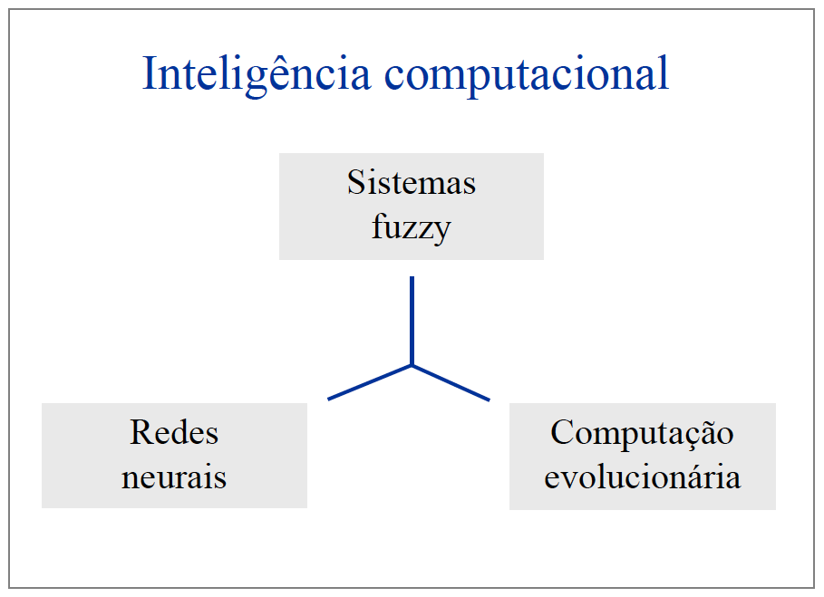
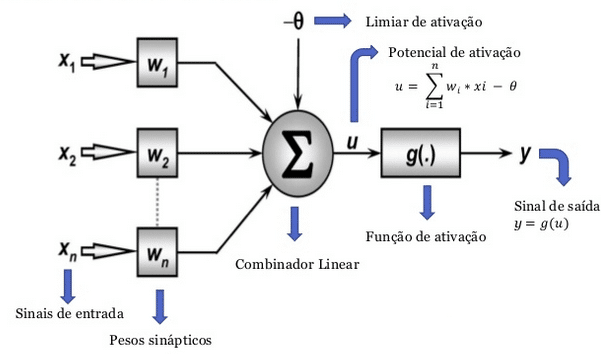

# Introdução
Olá, meu nome é Gabriel Rosa. No momento, sou estudante de Engenharia de Computação no CEFET-MG. Este repositório busca armazenar todas atividades realizadas durante a execução da materia de Inteligência Artificial... Qualquer dúvida ou detalhe que deseja tratar sobre estes documentos, sinta-se a vontande para propor algo ou entrar em contato.   Att. Gabriel.

## Arquivos em ordem cronológica 
1. <a href="https://github.com/Sr-Souza-dev/AI/tree/main/vacuum-cleaner">Vaccum-Cleaner<a> -> Sistema racional capaz de lipar dois compartimentos;
2. <a href="https://github.com/Sr-Souza-dev/AI/tree/main/search-solution(missionary-cannibals)">Search-solution(missionary-cannibals)<a> -> Sistema racional que resolve problema do 'missionarios e canibals' através de busca em arvore BFS;
3. <a href="https://github.com/Sr-Souza-dev/AI/tree/main/search-solution(vacuum-cleaner)">Search-solution(vacuum-cleaner)<a> -> Evolução do algoritmo 1 em um ambiente 3x3 solucionado por BFS.
4. <a href="https://github.com/Sr-Souza-dev/AI/tree/main/prolog">Prolog<a> -> Estudo sobre a linguagem Prolog e desenvolvimento de um chatbot.

# Resumo
## Agentes
O agente é aquele capaz de identificar o ambiente e atuar sobre ele, formando um ciclo infinito de execução: Identifica Ambiente -> Atua sobre o ambiente -> Identifica o 'novo' ambiente...

  
"Racionalidade maximiza o desempenho esperado; Onisciência maximiza o desempenho REAL"   

**O agente pode ter:** 

1. *Onisciência:* O agente tem infromações de todo o ambiente de atuação (sabe como o ambiente esta a cada momento).
2. *Aprendizado:* O agente já realizou determinada atividades algumas vezes e consegue fazer suposições racionais a partir da experiência em execuções futuras
3. *Autonomia:* É o agente que contém algum conhecimento prévio, conseguir realizar/obter outros conhecimento a partir disso.

 

**Agente Racional (PEAS)**

1. *Performance:* É uma medida quantitativa que classifica o desempenho do agente (o agente é racional se maximiza o valor da performace).
2. *Environment:* É o ambiente de atução do agente. Ex: Cozinha, transito... (Um agente deve ser capaz de identificar o ambiente e realizar algo sobre ele)
3. *Actuators:* São os componetes do agente que realizam a função de resposta. Ex: Para um carro tem-se: freio, acelerado... (Um agente racional para determinado ambiente é capaz de atuar sobre ele)
4. *Sensors:* São componetes do agente que o faz compreender/identificar o ambiente/estado em que ele esta inserido. Ex: Para um carro tem-se: velocimetro, termômetro...
 

 

**Propriedades de Ambientes de Tarefas** 

1. *Completamente observável:* Para definir se o ambiente será completamente observável, primeiramente é necessario definir os limites do ambiente, caso os sensores do agente seja capaz de contempler todo ambiente então podemos afirmar que ele está em um ambiente totalmente observável == 'onisciênte'.
2. *Parcialmente observável:* É quando os sensores do agente não conseguem contemplar todo o ambiente (ao qual ele esta inserido) ao mesmo tempo.
3. *Determinístico:* ambiente determinístico é quando o agente está prestes a realizar uma tarefa e já tem total certeza do resultado que essa ação gerará. Ex: Vai executar a limpeza de um ambiente e tem total certeza que ao final o ambiente estará limpo.
4. *Estocástico:* Ambiente estocástico é quando o agente está prestes a realizar uma tarefa e não tem total certeza do resultado que será gerado (não consegue garantir a resposta do ambiente devido a uma ação realizada). Ex: considerando um carro, ele está acelerando, mas pode cair em um buraco e parar de andar mesmo ele estando acelerando, chamamos este ambiente de estocástico.
5. *Estratégico:* Se o ambiente é determinístico exceto pelas ações de outros agentes, dizemos que o ambiente é estratégico. Ex: no caso de um carro, o agente sabe que se ele frear o carro tente a diminuir sua velocidade até parar, mas considerando um outro agente que pode pegar o carro e empurra-lo, este ambiente se torna estratégico.
6. *Estático:* O ambiente é considerado estático, quando, a partir do momento que o agente começa a atuar, o ambiente de atuação permanece o mesmo até o fim da execução.
7. *Dinâmico:* O ambiente é considerado dinâmico quando ele pode conter novo estados que não foram causados pelo agente (Ex: Considerando um aspirador de pó, enquanto ele está limpando tem algo jogando mais sujeira no ambiente).
8. *Episódico:* O ambiente episódico é quando somente o estado atual importa, o que veio antes não interfere na resposta do agente (Ex: na separação de produtos, é verificado somente qual produto o agente esta visualizando caso lixo ele manda para lixeira e caso reciclavel ele deixa passar).
9. *Sequencial:* O ambiente é considerado sequencial quando resultados anteriores influenciam na resposta atual do agente (Ex: considerando um aspirador de pó com o ambiente sequencial, ele será capaz de armazerar o estado atual da sala, não precisando visita-lá a todo momento para verificar se ela esta limpa, podendo apenas conferir em seu histórico).
10. *Discreto:* É quando há um número limitado e claramente definido de percepções e ações (Ex: Xadrez tem um número finito de estados distintos. Ações e percepções são discretas)
11. *Contínuo:* Sendo o inverso do discreto, no ambiente de estado contínuo, é quando não há um número limitado e claramente definido de percepções e ações (Ex: Estado continuo e tempo continuo. A
velocidade e localização do táxi e de outros veículos andando através de um espaço de valores contínuos e fazendo isso suavemente ao longo do tempo. Ações são também contínuos 'dobrar a direção').
 

**Programa x Ação do Agente**

Um agente é composto por seu código, que são os 'ifs,elses' e por sua arquitetura, que são a interconexão do código com o ambiente de atuação (meios fisícos ou lógicos).

1. *Programa do Agente*: É quando o agente utiliza somente de um único estado para realizar alguma função (algo reativo).
2. *Função do Agente*: É quando o agente utiliza de todo o historico para responder/realizar uma função.

**Agente Reativo**

1. *Agente Reativo Simples*: O agente funciona apenas se o ambiente do evento for completamente observável e a decisão correta puder ser tomada com base apenas na percepção atual (Faz somente o que foi programado, se alguma situação mudar, ele não sabe como reagir ou atuar de forma diferente. Ex: Aspirador pode nunca parar de se movimentar se os dois ambientes estiverem limpos).
2. *Agente Baseado em Modelos*: Antes de executar alguma ação, este agente recebe um conhecimento a priori que visa identificar como o mundo está no momento atual e efeitos de ações passadas aplicada ao ambiente. 
3. *Agente Baseado em Objetivo*: Sendo bem próximo ao agente baseado em modelos, esse agente possui um conhecimento a priori que é capaz de identificar o ambiente atual e analisar como sua ação afeta ao abiente antes mesmo de toma-la.
4. *Agente Baseado em Utilidade*: Tentam maximizar seu resultado, pondera a probabilidade de sucesso em relação a importância de objetivos. 
5. *Agente de Resolução de Problemas*: É um agente baseado em modelos que contém um conhecimento mais geral do problema a ser solucionado, sabe seu espaço de estados e procura nele uma solução boa (possibilitando a execução de buscas por soluções viáveis).
  

**Observação:** Agentes podem encontrar boas soluções através de buscas em árvore, para mais informações sobre os algoritmos de buscas e suas aplicabilidades <a href="***">aperte aqui</a>.

  

## Propositional Logic
O comportamento central de um agente baseado em conhecimento é sua base de conhecimento (KB). Informalmente uma base de conhecimento é o conjunto de sentenças, o qual cada sentença é expressa em uma linguagem de representação do conhecimento. 

Há duas abordagens interessantes para a a construção do agente baseado em conhecimento, sendo elas: 
1. Declarativa: Começa com uma base de conhecimento vazia, tal que o projetista pode INFORMAR(TELL) sentenças uma a uma até que o agente saiba comom operar em seu ambiente.
2. Procedural: Em contraste com a abordagem declarativa, a abordagem procedural codifica comportamentos desejados diretamente como código de programa. 

**OBS1:** Um agente bem sucedido sempre deve combinar elements declarativos e procedurais em seu projeto.
 

### Inference
Encadeamento para frente e para trás são os modos usados ​​pelo Inference Engine para deduzir novas informações da base de conhecimento. O Inference Engine é um dos principais componentes do sistema inteligente em Inteligência Artificial que aplica um conjunto de regras lógicas às informações existentes (Base de Conhecimento) para deduzir novas informações do fato já conhecido. 

#### Encadeamento para Frente:
O encadeamento direto conhecido por alguns como raciocínio direto ou dedução direta começa com o fato conhecido ou sentença atômica na base de conhecimento e gradualmente regras de inferência são aplicadas aos fatos já conhecidos até atingirmos o estado objetivo. Em poucas palavras, o encadeamento direto toma uma decisão ou atinge o estado da meta com base nos dados disponíveis.  O algoritmo mais simples de encadeamento para frente adiciona a base de conhecimento (KB) todas as sentenças atômicas que podem ser deduzidas em uma única etapa das senteças de implicação e das sentenças atômicas que já estão em KB.  
VANTAGENS:
   * O encadeamento direto funciona muito bem quando as informações disponíveis podem ser usadas para atingir o estado do objetivo;
   * O encadeamento direto tem a capacidade de fornecer muitos dados a partir dos dados iniciais limitados;
   * O encadeamento direto é mais adequado para a aplicação do sistema Expert que requer mais controle, planejamento e monitoramento;
   * O encadeamento direto deve ser aplicado quando houver um número limitado de estados ou fatos iniciais
 
DESVANTAGENS:
   * O mecanismo de inferência gerará novas informações sem saber quais informações serão elevantes para atingir o estado da meta;
   * O usuário pode ter que inserir muitas informações inicialmente sem saber quais informações serão usadas para atingir o estado da meta;
   * O Inference Engine pode disparar muitas regras que não contribuem para alcançar o estado da meta;
   * Pode dar uma conclusão diferente, o que pode resultar no alto custo do processo de encadeamento.
 

#### Encadeamento para Trás:
Encadeamento para trás ou Propagação para trás é o inverso do encadeamento para frente. Começa a partir do estado do objetivo e se propaga para trás usando regras de inferência, a fim de descobrir os fatos que podem apoiar o objetivo. Também é chamado de raciocínio orientado a objetivos. Inicia a partir do objetivo especificado, procura a ENTÃO parte da regra (parte de ação) se a regra for encontrada e sua parte SE corresponder à Regra de Inferência, em seguida, a regra será executada por outro Mecanismo de Inferência que a definirá como uma nova subobjetiva. 

VANTAGENS:
   * A pesquisa no encadeamento reverso é direcionada para que o processamento termine quando o fato for verificado;
   * O encadeamento reverso considera apenas partes relevantes da base de conhecimento para que nunca realize inferências desnecessárias;
   * Ao contrário do Forward Chaining, aqui são necessários apenas alguns pontos de dados, mas as regras são pesquisadas exaustivamente;
   * É muito eficiente para problemas como diagnóstico e depuração
 
DESVANTAGENS:
   * Como o encadeamento reverso é orientado por objetivos, é necessário conhecer previamente o objetivo para realizar o encadeamento reverso
   * É difícil implementar encadeamento reverso
 

## Learning with examples
Um agente está aprendendo ou melhorando se melhorar o seu desempenho nas tarefas futuras de aprendizagem após fazer observações sobre o mundo. Para isso, divide-se os dados disponíveis em três etapas, sendo elas:
1. **Treinamento**: O conjuto de treinamento remete aos dados que o agente terá para melhorar e ajustar os pesos de cada neurônio. É importante que o agente tenha mais dados na fase de treinamento do que na fase de teste, pois é necessário que ele esteja preparado para um range maior de possibilidades. 
2. **Validação**: Visto que o efeito da superadaptação ocorre em todo tipo de aprendizagem, mesmo quando a função de destino não for de todo aleatória, fez-se necessário a divisão de uma parte do conjunto de treinamento em validação, que visa parametrizar os modelos desde o mais simples (grau 0) até o mais complexo (grau mais elevado), afim de comparalos na etapa de treinamento. O modelo que obtiver o menor erro na etapa de treinamento será o utilizado, assim, evitado o efeito de superadaptação.
3. **Teste**: O conjunto de testes como o próprio nome remete, serve para testar e avaliar a qualidade da solução/função encontrada. É muito importante que está etapa seja realizada apenas após o seu treinamento, assim podemos evitar a espreita do agente.
 

* **Superadaptação:** Considere o problema de tentar prever se o lançamento de um dado vai dar 6 ou não. Suponha que o experimento seja realizado com dados diferentes e que os atributos que descrevem cada exemplo de treinamento incluem a cor do dado, seu peso, o tempo em que o lançamento foi feito e se os testadores tinha os dedos cruzados. Se os dados forem honestos, a aprendizagem correta será uma árvore com um único nó que diz "não", mas o algoritmo de 'aprendizagem em árvore de decisão" (essa árvore pode ser visualizada no tópico 'Decision Tree' abaixo) vai se aproveitar de qualquer padrão encontrado na entrada. Se for descoberto que há dois lances de um dado azul de 7 g com os dedos cruzados e os dois dão 6, então o algoritmo pode construir um caminho que prevê 6 nesse caso, mesmo não sendo corre. (Tal efeito pode ser evitado com mais exemplos no conjunto de testes - sendo que o conjunto de testes deve ser cada vez maior quando o grau da solução também for maior).

### Feedback to Learning
Existem quatro tipos de feedback que determinam os três principais tipos de aprendizagem:

1. **Aprendizagem não supervisionada:** O agente aprende padrões de entradas, embora não seja fornecido nenhum feedback explícito. A tarefa mais comun de aprendizagem não supervisionada é o agrupamento: a detecção de grupos de exemplos de entrada potencialmente úteis. Exemplo: um agente pode desenvolver gradualmente um conceito de 'dia de trafego bom' e 'dia de trafego ruim' sem nunca ter sido rotulados exemplos de cada um deles por um ser externo, ou seja, ele se desenvolve com o conjunto de suas percepções e desenvolve conceitos não introduzidos ou indicados. 
2. **Aprendizagem por reforço:** O agente aprende a partir de uma série de reforços (recompensas ou punições). Por exemplo, a falta de gorjeta ao final de uma corrida dá ao agente do táxi a indicação de que algo saiu errado.
3. **Aprendizagem supervisionada:** O agente observa (recebe) alguns exemplos de pares de entrada e saída, e aprende uma função que faz o mapeamento da entrada para a saída. Por exemplo, um agente que deseja prever o valor de uma ação no dia seguinte, na sua fase treinamento ele recebe um conjunto de entradas e uma saída esperada.
4. **Aprendizagem semissupervisionada:** São dados poucos exemplos rotulados e deve-se fazer o que puder de uma grande coleção de exemplos não rotulados. Por exemplo, um agente que visa prever a idade das pessoas, a princípio ele vê o rosto das pessoas e recebe sua idade (expressas por elas mesmas), porém algumas podem mentir, não falar... portanto não haverá somente ruidos aleatórios nos dados, mas as imprecisões são sistemáticas, e descrobi-las é um problema de aprendizagem não supervisionada, envolvendo imagens, idades autorrelatadas e idades verdadeiras. Assim, tanto ruído como falta de rótulo cria um continuum entre aprendizagem supervisionada e não supervisionada.

### Kinds of problems
Há dois tipos de problemas que são capazes de representar toda forma de aprendizagem, sendo eles:
1. **Classificação:** É um tipo em que se deseja inserir elemenos a um conjunto de conjuntos restritos. Por exemplo, quando a saída for de um conjunto finito de valores (como ensolarado, nublado ou chuvoso), o problema é chamado de classificação
2. **Regressão:** Se trata de saídas com um range mais amplo (conjunto tendendo ao infinito). Por exemplo, se a saída for um número (como temperatura de amanhã), o problema de aprendizagem é chamado de regressão.

### Decision Tree
A indução de árvore de decisão é uma das formas mais simples, e ainda assim mais bem-sucedidas, de aprendizagem de maquina. Primeiro, descrevemos a representação, o espaço de hipótese e em seguida, como aprender uma boa hipótese. Para isso, a árvore de decisão como entrada um vetor de valores de atributos e retorna uma decisão (um valor de saída única). Sendo cada nó interno  da árvore um teste de um dos atributos de entrada e cada nó folha especifica um valor a ser retornado pela função. 

## Linear Regression and Classification
### Univalued Linear Regression
Uma função linear univalorada (linha reta), com entrada x e ytem a forma "Hw = W1*x + W0", onde W0 e W1 são coeficientes de valores reais a serem aprendidos (pesos). A tarefa de encontrar o "Hw" que melhor se encncaixe nos dados disponíveis é chamada de regressão linear. 

O caminho para encontrar os pesos [W0, W1] que minimizam a perda empírica pode ser através do calculo da função quadrática de Gauss, levando a função perda para um plano tridimensional. Como desejamos minimizar a perda da aproximação da função, basta calcular a descida pelo gradiente até encontrar o valor mínimo da função de 3D. O tamanho do passo (visto que a função continua tem infinitos valores entre dois números, o tamanho do passo define de quantos em quantos valores vamos caminhar nessa função) é geralmente chamado de **taxa de aprendizagem** quando estamos tentando minimizar a perda em um problema de aprendizagem. 

Esses metodos constituem a regra de aprendizagem:  
**Descida pelo gradiente em lotes:** Objetiva minimizar a soma das perdas individuais para cada exemplo de teste, realizando ajustes de forma interativa. A convergência é garantida para o único mínimo global, mas pode ser muito lenta, visto que, temos que percorrer todos os dados de treinamento para cada etapa.
**Descida estócastica pelo gradiente:** Considera um único ponto de treinamento por vez, seguindo uma etapa após a outra (calculando a perda em cada uma delas). Esse método de descida pode ser utilizado em um ambiente on-line, onde chegam novos dados, um de cada vez, ou off-line, onde percorremos os mesmos dados tantas vezes quantas forem necessárias, selecionando uma etapa depois de considerar cada exemplo.

### Linear Classification
As funções lineareas podem ser usada tanto para regressão quanto para classificação. Para isso temos o conceito de fronteira de separação, tal que:
**Fronteira de separação:** É uma linha (ou uma surperficie, em dimensões superiores) que separa as duas classes. O limite de decisão é chamado de separador linear e os dados que admitem tal separador são chamados de linearmente separáveis.

  

Após encontra a fronteira de separação, é necessário definir um classificador linear (que determina a qual conjunto um determinado dado pertence), para isso tem-se as seguintes funções:
| -------- | -------- |
| **Limiar**: Converge para uma solução se classes são linearmente separaveis. |   |
| -------- | -------- |
| Resultados encontrados com o uso do classificador Limiar |  |
| **Logística:** Sendo também conhecida como função sigmoide, a função logística se comporta melhor em pontos perto do Limiar (centro de incerteza da separação), ela é como se fosse uma suavização da função Limiar, tornando-a continua. O processo de ajuste dos pesos desse modelo é chamado de regressão lógistica |  |
| --------- | -------- |
| Resultados encontrados com o uso do classificador Logística |  |
| -------- | --------- |

### Support Vector Machine (SVM)
Quando os dados não são linearmente separáveis, deve-se utilizar uma outra abordagem conhecida como "máquina de vetor de suporte" que aproveita do conceito que - Linear em grande dimensão é não linear no espaço original.

A ideia é encontrar um objeto geométrico separador de classes, que pode ser uma linha em um espaço bidimensional, um plano em um espaço tridimensional ou um hiperplano, em um espaço n-dimensional de atributos.

**Obs:** A SVM também pode ser utilizada quando os dados são linearmente separáveis, porém ela terá um custo computacional mais elevado em comparação aos metodos lineares. Normalmente ultiliza-se o SVM para tudo, pois não sabemos se os dados são linearmente separáveis. 

# Computational Intelligence
A Inteligência Computacional, ou IC, ainda não tem um conceito definido totalmente, mas pode-se considerar a parte que estuda soluções imprecisas ou inexatas.

A IC tem relação com a computação macia, permitindo estudar áreas de conhecimento com pouco aprofundamento pelo ser humano. A diferença para a IA está nos modelos estudados.

Enquanto a IA estuda modelos com base no raciocínio humano, a IC estuda modelos com base nas áreas complexas da natureza, como o estudo de algoritmos genéticos, redes neurais artificiais ou mesmo a Inteligência de Enxames.

Podendo ser dividida em 3 grandes áres: redes neurais, sistemas fuzzy e computação evolutiva.

## Artificial Neural Networks
A hipótese de que a atividade mental consiste basicamente na atividade eletroquímica em redes de células cerebrais chamadas neurônios inspirou varia teorias. Alguns dos trabalhos mais antigos de IA tiveram o objetivo de criar redes neurais artificiais (outros nomes do campo incluem conexionismo, processamento distribuído em paralelo e computação neural). Grosseiramente
falando, ele “dispara” quando uma combinação linear de suas entradas excede algum limiar (rígido
ou suave), ou seja, ele implementa um classificador linear. Uma rede neural é apenas uma coleção de unidades conectadas; as propriedades da rede são determinadas pela sua topologia e pelas propriedades dos “neurônios”.

# References 
<a src="https://www.digitalhouse.com/br/blog/maquina-de-vetores-de-suporte/">Support Vector Machine</a>  
<a src="https://medium.com/@avinicius.adorno/redes-neurais-artificiais-418a34ea1a39">Artificial Neural Networks</a>  