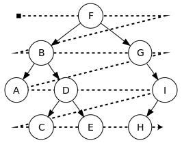
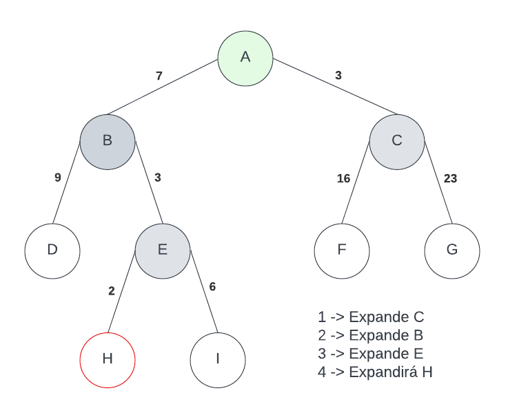
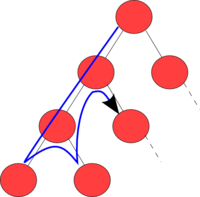
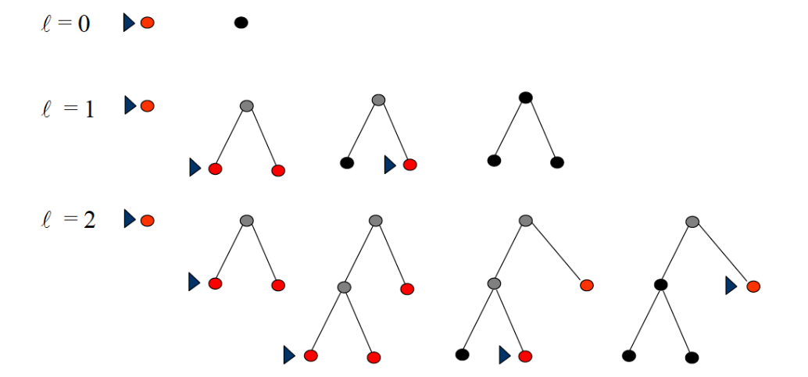
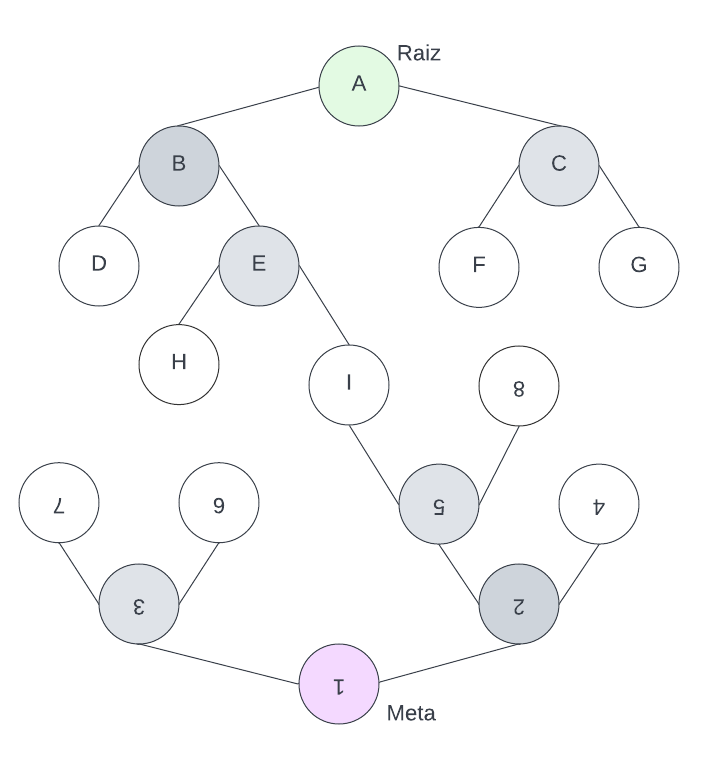

# Introdução
Olá, meu nome é Gabriel Rosa. No momento, sou estudante de Engenharia de Computação no CEFET-MG. Este repositório busca armazenar todas atividades realizadas durante a execução da materia de Inteligência Artificial... Qualquer dúvida ou detalhe que deseja tratar sobre estes documentos, sinta-se a vontande para propor algo ou entrar em contato.   Att. Gabriel.

## Arquivos em ordem cronológica 
1. Vaccum-Cleaner (Sistema racional capaz de lipar dois compartimentos)
2. Search-solution(cannibals-vacuumCleaner) (Sistema racional que resolve problema do 'missionarios e canibals' através de busca em arvore)

# Resumo
## Agentes
O agente é aquele capaz de identificar o ambiente e atuar sobre ele, formando um ciclo infinito de execução: Identifica Ambiente -> Atua sobre o ambiente -> Identifica o 'novo' ambiente...

  
"Racionalidade maximiza o desempenho esperado; Onisciência maximiza o desempenho REAL"   

**O agente pode ter:** 

1. *Onisciência:* O agente tem infromações de todo o ambiente de atuação (sabe como o ambiente esta a cada momento).
2. *Aprendizado:* O agente já realizou determinada atividades algumas vezes e consegue fazer suposições racionais a partir da experiência em execuções futuras
3. *Autonomia:* É o agente que contém algum conhecimento prévio, conseguir realizar/obter outros conhecimento a partir disso.

 

**Agente Racional (PEAS)**

1. *Performance:* É uma medida quantitativa que classifica o desempenho do agente (o agente é racional se maximiza o valor da performace).
2. *Environment:* É o ambiente de atução do agente. Ex: Cozinha, transito... (Um agente deve ser capaz de identificar o ambiente e realizar algo sobre ele)
3. *Actuators:* São os componetes do agente que realizam a função de resposta. Ex: Para um carro tem-se: freio, acelerado... (Um agente racional para determinado ambiente é capaz de atuar sobre ele)
4. *Sensors:* São componetes do agente que o faz compreender/identificar o ambiente/estado em que ele esta inserido. Ex: Para um carro tem-se: velocimetro, termômetro...
 

 

**Propriedades de Ambientes de Tarefas** 

1. *Completamente observável:* Para definir se o ambiente será completamente observável, primeiramente é necessario definir os limites do ambiente, caso os sensores do agente seja capaz de contempler todo ambiente então podemos afirmar que ele está em um ambiente totalmente observável == 'onisciênte'.
2. *Parcialmente observável:* É quando os sensores do agente não conseguem contemplar todo o ambiente (ao qual ele esta inserido) ao mesmo tempo.
3. *Determinístico:* ambiente determinístico é quando o agente está prestes a realizar uma tarefa e já tem total certeza do resultado que essa ação gerará. Ex: Vai executar a limpeza de um ambiente e tem total certeza que ao final o ambiente estará limpo.
4. *Estocástico:* Ambiente estocástico é quando o agente está prestes a realizar uma tarefa e não tem total certeza do resultado que será gerado (não consegue garantir a resposta do ambiente devido a uma ação realizada). Ex: considerando um carro, ele está acelerando, mas pode cair em um buraco e parar de andar mesmo ele estando acelerando, chamamos este ambiente de estocástico.
5. *Estratégico:* Se o ambiente é determinístico exceto pelas ações de outros agentes, dizemos que o ambiente é estratégico. Ex: no caso de um carro, o agente sabe que se ele frear o carro tente a diminuir sua velocidade até parar, mas considerando um outro agente que pode pegar o carro e empurra-lo, este ambiente se torna estratégico.
6. *Estático:* O ambiente é considerado estático, quando, a partir do momento que o agente começa a atuar, o ambiente de atuação permanece o mesmo até o fim da execução.
7. *Dinâmico:* O ambiente é considerado dinâmico quando ele pode conter novo estados que não foram causados pelo agente (Ex: Considerando um aspirador de pó, enquanto ele está limpando tem algo jogando mais sujeira no ambiente).
8. *Episódico:* O ambiente episódico é quando somente o estado atual importa, o que veio antes não interfere na resposta do agente (Ex: na separação de produtos, é verificado somente qual produto o agente esta visualizando caso lixo ele manda para lixeira e caso reciclavel ele deixa passar).
9. *Sequencial:* O ambiente é considerado sequencial quando resultados anteriores influenciam na resposta atual do agente (Ex: considerando um aspirador de pó com o ambiente sequencial, ele será capaz de armazerar o estado atual da sala, não precisando visita-lá a todo momento para verificar se ela esta limpa, podendo apenas conferir em seu histórico).
10. *Discreto:* É quando há um número limitado e claramente definido de percepções e ações (Ex: Xadrez tem um número finito de estados distintos. Ações e percepções são discretas)
11. *Contínuo:* Sendo o inverso do discreto, no ambiente de estado contínuo, é quando não há um número limitado e claramente definido de percepções e ações (Ex: Estado continuo e tempo continuo. A
velocidade e localização do táxi e de outros veículos andando através de um espaço de valores contínuos e fazendo isso suavemente ao longo do tempo. Ações são também contínuos 'dobrar a direção').
 

**Programa x Ação do Agente**

Um agente é composto por seu código, que são os 'ifs,elses' e por sua arquitetura, que são a interconexão do código com o ambiente de atuação (meios fisícos ou lógicos).

1. *Programa do Agente*: É quando o agente utiliza somente de um único estado para realizar alguma função (algo reativo).
2. *Função do Agente*: É quando o agente utiliza de todo o historico para responder/realizar uma função.

**Agente Reativo**

1. *Agente Reativo Simples*: O agente funciona apenas se o ambiente do evento for completamente observável e a decisão correta puder ser tomada com base apenas na percepção atual (Faz somente o que foi programado, se alguma situação mudar, ele não sabe como reagir ou atuar de forma diferente. Ex: Aspirador pode nunca parar de se movimentar se os dois ambientes estiverem limpos).
2. *Agente Baseado em Modelos*: Antes de executar alguma ação, este agente recebe um conhecimento a priori que visa identificar como o mundo está no momento atual e efeitos de ações passadas aplicada ao ambiente. 
3. *Agente Baseado em Objetivo*: Sendo bem próximo ao agente baseado em modelos, esse agente possui um conhecimento a priori que é capaz de identificar o ambiente atual e analisar como sua ação afeta ao abiente antes mesmo de toma-la.
4. *Agente Baseado em Utilidade*: Tentam maximizar seu resultado, pondera a probabilidade de sucesso em relação a importância de objetivos. 
5. *Agente de Resolução de Problemas*: É um agente baseado em modelos que contém um conhecimento mais geral do problema a ser solucionado, sabe seu espaço de estados e procura nele uma solução boa (possibilitando a execução de buscas por soluções viáveis).

## Árvores de Busca
Há dois tipos de busca em arvores:
1. Não informado: Usuam somente definições do problema (como: depth-first, breadth-first...)
2. Informado: Usam conhecimento sobre o domínio (além) do problema e heurísticas (como: Greedy best-first, A*).

### Medição de desempenho de resolução de problemas e coplexidade
#### Desempenho:
1. Completeza: O algoritmo é capaz de achar a solução se ela existir.
2. Otimização: O algoritmo é capaz de encontrar uma resolução ótima. 
3. Complexidade de Tempo: É o tempo que o algoritmo gasta para encontrar determimnada solução.
4. Complexidade de espaço: É o espaço em memória que o algoritmo gata para enocntrar determinada solução.

#### Complexidade:
1. Fator de Ramificação (b): número máximo de sucessores de um nó;
2. Profundidade (d): profundidade do nodo objetivo mais raso;
3. Comprimento Trajetória (m): maior entre todas as trajetórias. 

## Buscas não Informadas

### Breadth-First Search (Busca em largura)
A busca em largura expande sempre toda a fronteira até encontrar o resultado (meta), ou seja, ela verifica o primeiro filho do node, caso ele não seja o resultado ela o expande, em seguida ela verifica o segundo filho do node, caso ele não seja o resultado ela o expande também, fazendo isso até encontrar a meta. Gerando uma árvore com mais nós folhas devido a sua maneira de expansão e ao armazenamento dos nodos.

* *Completeza*: completo (se b é finito);
* *Otimização*: não necessariamente ótimo, a menos que o custo trajetória seja igual para todas as direções de expansão;
* *Complexidade de Tempo e espaço*: tempo e memória (profundidade da meta = d, qtd de filhos em cada nodo = b) -> b + b^2 + ... + b^d = O(b^d).  

### Uniform Cost Search (Busca de custo uniforme)
No algoritmo de busca de custo uniforme as transições de um nodo para outro são ponderadas, sendo que, atráves desse valor o algoritmo faz sua escolha de expansão, ou seja, ele expandirá sempre a fronteira que tiver menor custo em relação a raiz da árvore.

* *Completeza*: Completo se cada passo tem custo ε > 0;
* *Otimização*: Ótimo geral
* *Complexidade de Tempo e espaço*: O(b^{1 + (C*/ε)}) >= O(b^d);
* *Complexidade de Tempo e espaço (se custo dos passos iguais)*: O(b^{d+1});
em que 'C*' é o custo da solução ótima, 'd' profundidade da meta e 'b' qtd máx de filhos em cada nodo.

### Depth-First Search (Busca em profundidade)
Expande/percorre de um vertice até os vértices 'filhos', o mais profundo possível, para somente depois retroceder. (Seu objetivo é descer/aprofundar ao máximo respeitando uma lógica inicial até encontrar o resultado esperado). Caso o algoritmo chegue no ponto mais profundo daquele caminho e não encontre a meta, ele começará a retroceder e apagar as partes já visitadas da arvore para poupar espaço de armazenamento. 

* *Completeza*: Este código pode ser considerado completo dependendo do ambiente ao qual ele está operando, caso o ambiente tenha muitos/infinitos estados ele demorará muito para encontrar uma resposta, ou nem encontrará (Completo somente para espaço de estado finito).
* *Otimização*: Não, pois ele aceitará a primeira solução encontrada.
* *Complexidade de Tempo*: O(b^s), tal que 'b' é a quantidade de nodos filhos que um nodo tem e 's' é a profundidade máxima de um nodo.
* *Complexidade de espaço*: O(bs)  

### Depth-limited Search (Busca em profundidade Limitada)
A busca em profundidade limitada é uma modificação da busca em profundidade explicada no tópico antérior. Para tentar amenizar a ideia de que possa haver um caminho infinito em ralação a profundidade, esse tipo de busca delimita o tamanho em que o algoritmo pode explorar da árvore, focando apenas em uma arvore menos de altura (l) definida pelo programador. 

* *Completeza*: Não é completo, pois o tamanho 'l' escolhido pode ser menor que o tamanho 'd' (produndidade do nodo meta).
* *Otimização*: Não é otimo. 
* *Complexidade de Tempo e espaço*: O(b^l)
obs: Conhecimento do dominio da aplicação ajuda a delimitar o limite.

### Iterative-deepening Search (Busca em profundidade progressiva)
Sendo um algoritmo considerado evolução do algoritmo anterior (Depth-limited Search), neste tipo de busca, o limite é algo dinâmico, sendo atualizado a cada tentativa sem sucesso. Ou seja, ele realizará a primeira interação com um limite 'X', caso ele não encontre a meta, ele fará outra interação com limite 'X+ε', segue assim recurssivamente até encontrar a meta, caso ela exista.

* *Completeza*: Sim se caso o espaço de estados seja finito
* *Otimização*: SIm se os custos de transição forem iguais em toda arvore
* *Complexidade de Tempo*: O(b^d)
* *Complexidade de espaço*: O(bd)
em que, 'b' é o fator de ramificação e 'd' é a profundidade da solução. 

### Bidirectional Search (Busca bidirecional)
Nem tanto um algoritmo, mas parte mais de uma ideia de como buscar determinado caminho tendo conhecimento da sua meta. No algoritmo de busca bidirecional são feitas buscas em largura ou profundidade na raiz e meta da arvore, quando as duas busca encontram um nodo em comum, significa que um caminho que conecta a meta a raiz foi encontrado. 

* *Completeza*: Sim se 'b' finito
* *Otimização*: sim se custos de transição entre os nodos forem iguais.
* *Complexidade de Tempo e espaço*: O(b^{d/2})

## Buscas Informadas
A técnica de busca informada utiliza o conhecimento específico do problema para dar uma pista para a solução do problema. Aqui, a parte mais importante da técnica informada é a função heurística (h(n)) que facilita a transmissão do conhecimento adicional do problema ao algoritmo. Como resultado, ajuda a encontrar o caminho para o objetivo através dos vários nós vizinhos. Existem vários algoritmos baseados na pesquisa informada, como pesquisa heurística em profundidade, pesquisa heurística em amplitude/largura, busca A *, etc.
 
A pesquisa informada pode ser vantajosa em termos do custo, em que a otimização é alcançada com custos de pesquisa mais baixos.

### Caracteristicas
* Conhecimento domínio + problema;
* Função avaliação f(n);
* Função heurística h(n);
* Conhecimento na forma de heurísticas;
* Algoritmos do tipo best-first (melhor escolha).

em que:
* n: nó da árvore;
* f(n): valor de f em n (estimativa custo mínimo através de n);
* g(n): custo do caminho da raiz até n;
* h(n) : estimativa do custo mínimo de n até a meta

### Best First / Greedy Search (Busca Gulosa)
Os algoritmos de busca gulosa é similar do algoritmo de busca de custo uniforme, sendo a heurística a função que pondera o custo de cada nodo/transição. Diferente do algoritmo de busca de custo uniforme que visa o ótimo geral, esse algoritmo visa encontrar a solução o mais rápido possível (com menor custo computacional) atráves da heurística inserida, sem garantir otimalidade. Ou seja, enquanto no algoritmo de custo uniforme o nodo expandido é o de menor custo em relação ao nodo atual, na busca gulosa o nodo expandido é o que está mais próximo a meta (condição final) de acordo com a heurística inserida.

* *Completeza*: Na maioria dos casos ele é incompleto (depende da heurística aplicada) 
* *Otimização*: Não é ótimo, devido a sua busca ser direcionada ao menor gasto computacional possível, ele somente tenta encontrar a solução.
* *Complexidade de Tempo e espaço*: O(b^m), em que 'b' é o fator de ramificação da arvore e 'm' é a profundidade máxima da arvore de busca.

 
OBS: O algoritmo de busca gulosa considera somente a heurística do problema, sendo: f(n) = h(n)

### Best First / A*
Para esse algoritmo garantir a otimalizadade do problema, é necessario que haja uma heurística admissível, sendo que, uma heurística é dita como admissível se ela nunca superestima o custo h(n) de atingir o objetivo a partir do nodo n (g(n) + h(n) <= g(n*) === O custo do caminho da raiz até o nodo + o custo da heuristica do nodo até a meta deve ser <= Ao custo real da raiz até a meta)
Essa busca utiliza de duas informações para definir os seus passos, ela soma o custo da raiz até um determinado nodo e desse mesmo nodo até a meta (por heuristica), o nodo que apresentar o menor valor é o que será expandido e sequentemente verificado.

* *Completeza*: Sim
* *Otimização*: Sim (se heuristica admissivel)
* *Complexidade de Tempo e espaço*: Complexidade é exponencial
* *Complexidade de espaço*:

* *Completeza*: 
* *Otimização*:
* *Complexidade de Tempo*:
* *Complexidade de espaço*:

