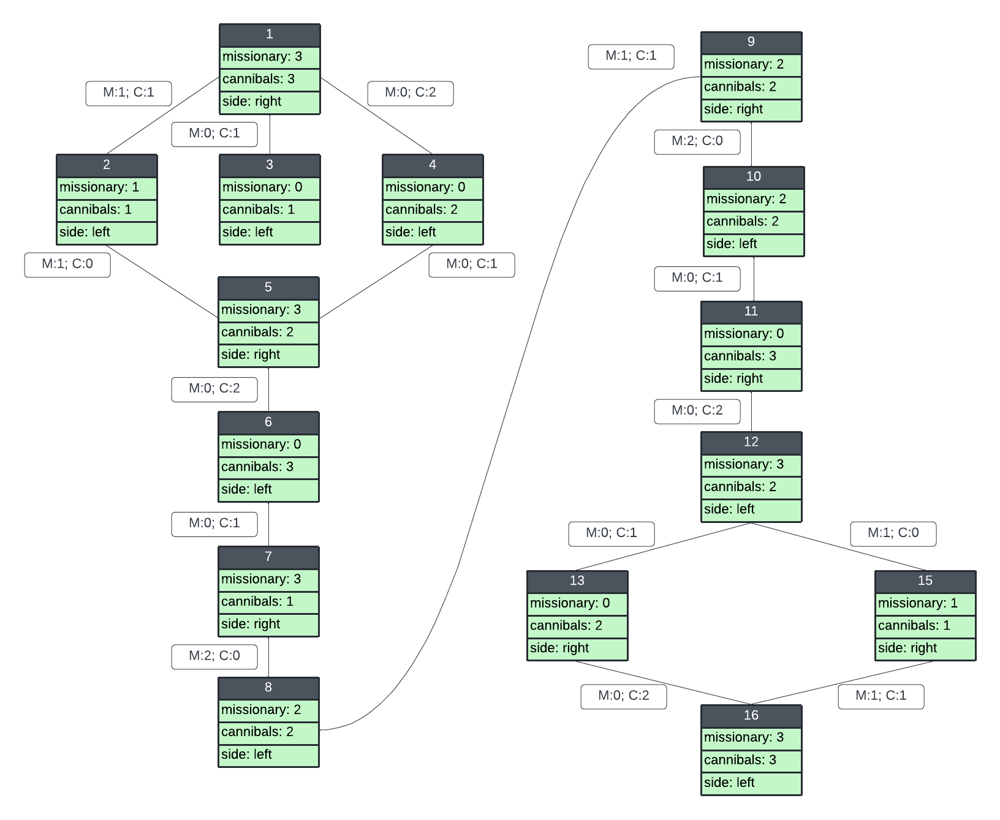

# Descrição
O objetivo deste diretório é resolver um problema considerado básico no ramo da inteligência artificial (canibais e missionários), o qual foi utilizado por <a href="https://en.wikipedia.org/wiki/Saul_Amarel"> Saul Amarel<a> como um exemplo de representação de problemas.
 
No problema dos canibais e missionários, três missionários e três canibais precisam atravessar um rio com um barco que pode transportar no máximo duas pessoas (permitindo serem do mesmo grupo ou de grupos diferentes), sob a restrição de que, para ambas as margens, se há missionários presentes naquela margem, eles não podem ser ultrapassados pelo número de canibais na mesma margem (se fossem, os canibais comeriam os missionários.) O barco não pode atravessar o rio por si só, sem um ser a bordo.

## Jogo
O problema pode ser mais bem visualizado no <a href="https://www.jogosdaescola.com.br/canibais-e-missionarios/">JOGO<a> em que você deve passar todos os canibais e os missionários para o outro lado do rio. Cuidado para os canibais não devorarem os missionários! Utilize o mouse para jogar.

## Diagrama do espaço de estados
O diagrama de espaço de estados espresso abaixo considera todos os estados possiveis para o problema 'canibais e missionários', diferenciando os lados direito e esquerto do rio e suas possiveis combinações. 

