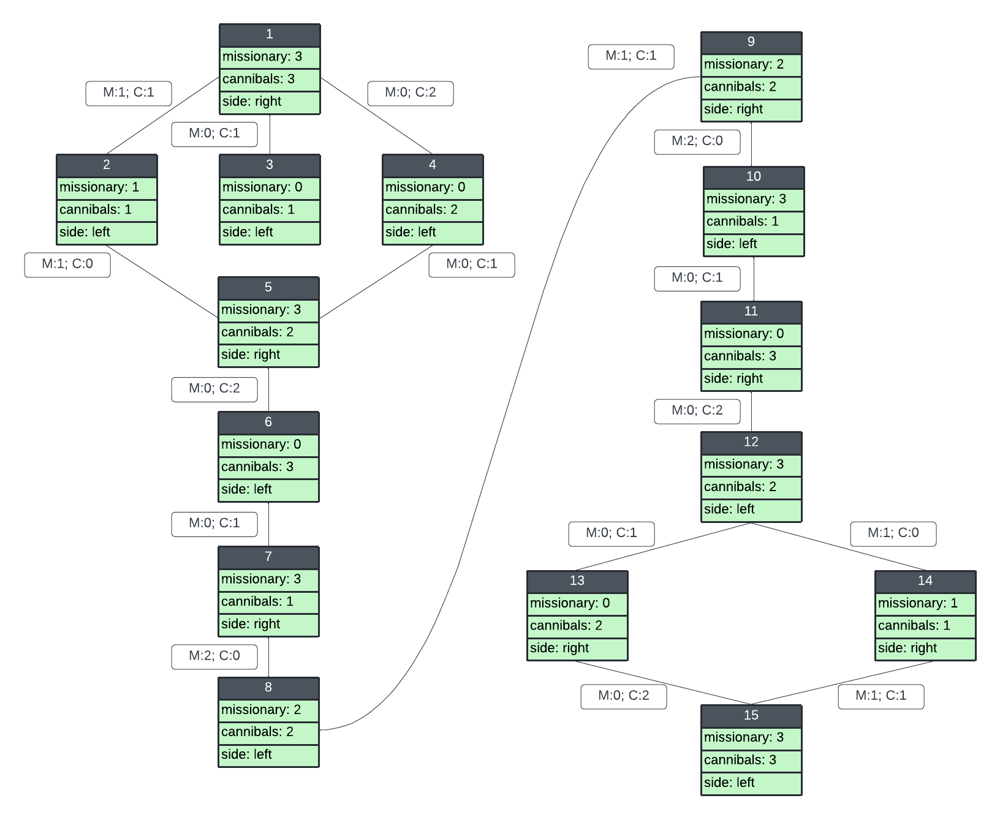

# Introdução
O objetivo deste diretório é resolver um problemas considerado básicos no ramo da inteligência artificial, sendo o primeiro 'canibais e missionários', o qual foi utilizado por <a href="https://en.wikipedia.org/wiki/Saul_Amarel"> Saul Amarel<a> como um exemplo de representação de problemas. Já o segundo problema trata uma alteração no ambiente do trabalho anterior (diretório 'vacuum-cleaner'), o qual deve-se limpar todas as salas que ainda estão sujas.

# Descrição (missionary-cannibals)
No problema dos canibais e missionários, três missionários e três canibais precisam atravessar um rio com um barco que pode transportar no máximo duas pessoas (permitindo serem do mesmo grupo ou de grupos diferentes), sob a restrição de que, para ambas as margens, se há missionários presentes naquela margem, eles não podem ser ultrapassados pelo número de canibais na mesma margem (se fossem, os canibais comeriam os missionários.) O barco não pode atravessar o rio por si só, sem um ser a bordo.

## Jogo
O problema pode ser mais bem visualizado no <a href="https://www.jogosdaescola.com.br/canibais-e-missionarios/">JOGO<a> em que você deve passar todos os canibais e os missionários para o outro lado do rio. Cuidado para os canibais não devorarem os missionários! Utilize o mouse para jogar.

## Diagrama do espaço de estados
Dado o problema descrito acima, é possível desenvolver a formulação do problema considerando as possibilidades de jogo, tal que:
* Estado Inicial: O estado inicial é o momento em que se inicia o jogo com 3 missionarios e 3 canibais ao lado direito do rio. 
* Ação: Sua ação parte do momento em que é possível transitar com pessoas para o outro lado do rio, gerando as seguintes possibilidade de composição no barco: (1,0),(0,1) e (1,1)
* Teste de objetivo: O teste de objetivo é feito a todo novo estado encontrado, comparando o estado atual com o estado meta, em que há 3 missionarios e 3 canibais ao lado esquerdo do rio.
* Função sucessora: A função sucessora define qual ação tomar (qual trajeto seguir diante várias possibilidade)
* Meta: É o estado que se deseja alcançar, dando fim ao jogo no cenário proposto (3 missionarios e 3 canibais ao lado esquerdo do rio).
  
Apartir das descrições definidas, o diagrama de espaço de estados expresso abaixo considera todos os estados possiveis para o problema 'canibais e missionários', diferenciando os lados direito e esquerto do rio e suas possiveis combinações. 

Como é possível observar, o espaço de estados do problema é bem definido logicamente, mas o que faz com que este problema seja dificilmente resolvido é a grande chance de mover de forma errada e cair em um loop (sempre voltando a estados ja passados).

   

**OBS:** O código desenvolvido considera o espaço de estados expressos na imagem acima (busca informada), para compreende-lo facilitadamente, execute-o com a imagem ao lado.

# Descrição (vacuum-cleaner)
O suposto arquivo (dirty.py) busca simular um agente que deve limpar um conjunto de 9 sala, dividas como uma matriz 3x3 que utiliza de metodologias de busca para encontrar uma melhor e mais racional racional para o problema. Seu modo de trabalho/atuação é totalmente definido e resultará sempre as mesmas respostas independente da quantidade de vezes que for executado (Ex: Se for dada a regra de 'limpar' o local ficará limpo).

## Análise
Para este problema, há diversas metodologias de busca que encontram uma sulução viável, como exemplo,  podemos utilizar a busca em largura, custo uniforme, profundidade e suas variações... O influência na escolha da melhor metodologia de pesquisa para o devido problema são os custos computacionais e otimalidade da solução. 
Como há muitos estados possiveis, o algoritmo de busca implementado foi o não informado por expansão em largura (busca em largura). Para desconsiderar a existência de loop é necessario que o problema seja modelado/tratado na forma de grafo, pois, será possível armazenar um 'histórico' dos estados já visitados.  